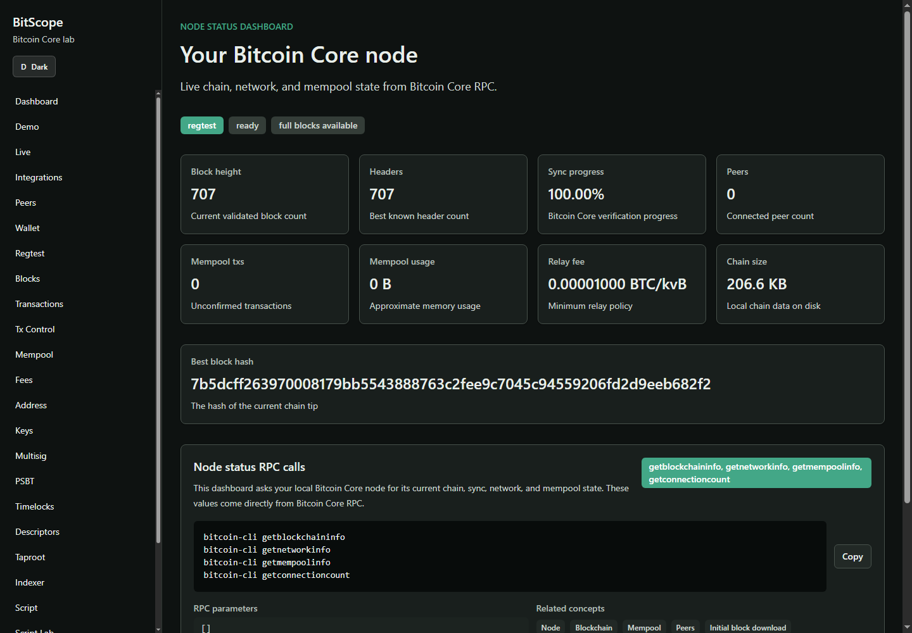
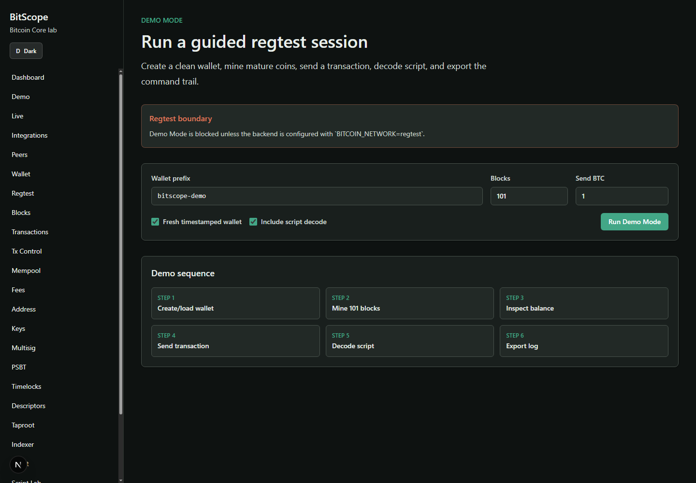
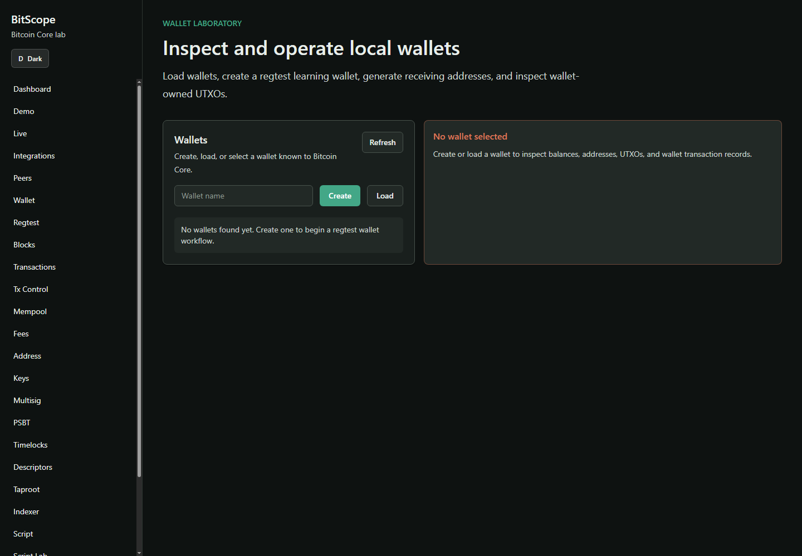
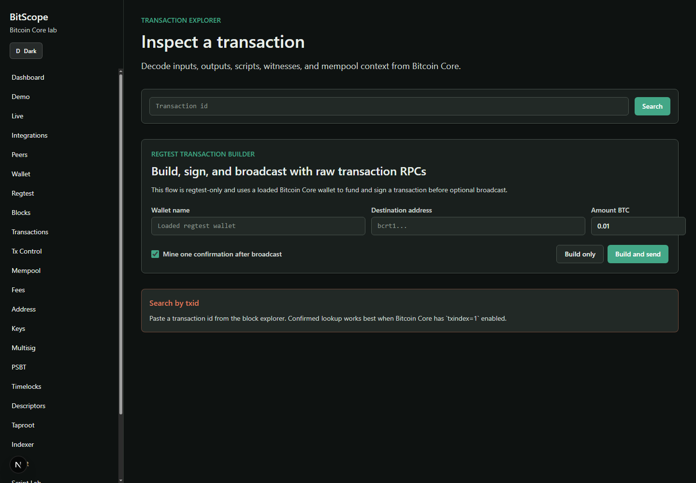
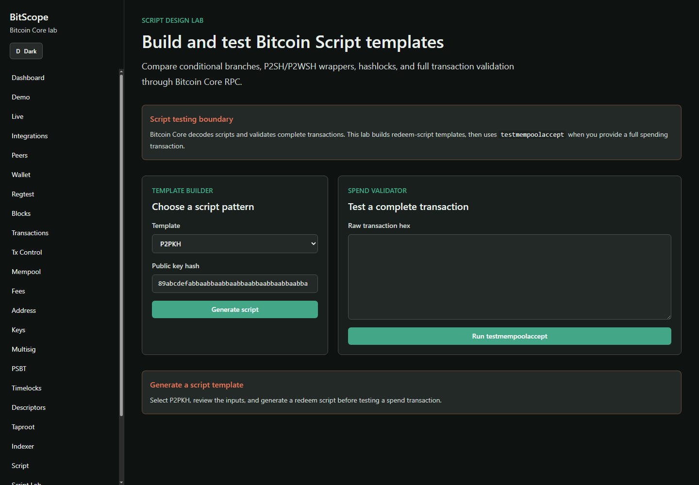
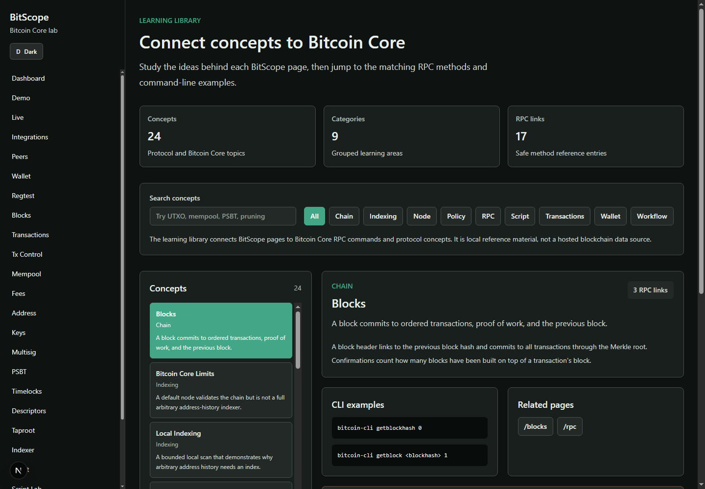

# BitScope

**An interactive Bitcoin Core laboratory powered entirely by your own node.**

BitScope is a learning-focused Bitcoin Core explorer and laboratory inspired by *Learning Bitcoin from the Command Line*. It is not a hosted block explorer clone: every major screen connects UI output back to `bitcoin-cli`, JSON-RPC methods, raw Bitcoin Core JSON, and a plain-English explanation.

## Screenshots

These screenshots show BitScope interacting with a local regtest node: node status, guided Demo Mode, wallet workflows, transaction inspection, script exploration, and the concept library.

| Node dashboard | Demo Mode |
| --- | --- |
|  |  |

| Wallet lab | Transaction explorer |
| --- | --- |
|  |  |

| Script Lab | Learning library |
| --- | --- |
|  |  |

## What BitScope Teaches

- Local node state: chain selection, sync, pruning, peers, network reachability, and live status.
- Blocks and transactions: headers, proof of work, Merkle roots, inputs, outputs, witnesses, fees, locktime, and the UTXO model.
- Wallet and regtest workflows: wallet loading, descriptors, addresses, UTXOs, mining, faucet sends, confirmations, and safe local spending.
- Mempool and fee policy: fee estimates, RBF, CPFP, ancestors, descendants, and `testmempoolaccept`.
- Script and advanced transaction flows: script decoding, script templates, timelocks, multisig, PSBTs, Taproot, OP_RETURN, descriptors, xpubs, and watch-only concepts.
- Integration practice: JSON-RPC examples, wallet RPC paths, polling-backed Server-Sent Events, and optional ZMQ configuration.

## Core Principles

- **Your Bitcoin Core node is the source of truth.**
- **No third-party blockchain APIs.** BitScope does not call mempool.space, Esplora, blockchain.com, or hosted indexers.
- **Mainnet is read-only by default.** Spending, signing, mining, and broadcast-style workflows are designed for regtest unless explicitly guarded.
- **Private key safety.** Educational key pages use public descriptors/xpub placeholders only and never request seed words, WIF keys, xprvs, or hardware-wallet PINs.
- **Bitcoin Core limits are shown honestly.** A default node cannot provide arbitrary public address history without wallet ownership, `txindex`, block context, or a local indexing layer.

## Feature Map

Implemented learning surfaces include:

- Dashboard, Live monitor, Peer/privacy dashboard, Integrations, and RPC explorer.
- Blocks, Transactions, Tx Control, Mempool, Fees, Address, and Local Indexer.
- Wallet, Regtest, Multisig, PSBT, Timelocks, Descriptors, Taproot, Keys.
- Script decoder, Script Lab, OP_RETURN Data Tx builder, and Learn library.

For the full route, service, and safety model, see [docs/architecture.md](docs/architecture.md).

## Architecture

- **Backend:** Python, FastAPI, Pydantic, Bitcoin Core JSON-RPC, pytest.
- **Frontend:** Next.js, TypeScript, Tailwind CSS.
- **Runtime source:** local Bitcoin Core RPC.
- **Optional runtime:** Docker Compose regtest stack with Bitcoin Core, backend, and frontend.
- **Public site:** static GitHub Pages docs and screenshots from `docs-site/`.

```text
backend/   FastAPI routes, services, RPC client, Pydantic models, tests
frontend/  Next.js app router pages, reusable components, typed API client
docs/      architecture, setup, operations, testing, limitations, and demo guides
docs-site/ GitHub Pages static documentation and screenshots
scripts/   local setup and Docker Compose helpers
```

The GitHub Pages deployment is intentionally documentation-only. The working BitScope app should run locally so the backend can connect to the user's own Bitcoin Core RPC endpoint without exposing credentials.

## Public Docs Site

The repository includes a static GitHub Pages site in `docs-site/` for public project visibility, screenshots, and architecture notes. It does not host the BitScope backend or connect to Bitcoin Core.

Enable it in GitHub with:

```text
Settings -> Pages -> Source: GitHub Actions
```

The workflow at `.github/workflows/pages.yml` publishes `docs-site/` on pushes to `main` and can also be run manually. The expected project URL is `https://comwanga.github.io/BitScope/` unless a custom domain is configured.

The docs site uses plain static HTML/CSS with relative asset paths, so refreshes work on GitHub Pages project hosting.

## Quick Start

Regtest is the recommended development and demo network.

1. Configure Bitcoin Core. See [docs/bitcoin-core-setup.md](docs/bitcoin-core-setup.md).

   ```conf
   regtest=1
   server=1
   rpcuser=your_rpc_user
   rpcpassword=your_rpc_password
   fallbackfee=0.00001000
   txindex=1
   ```

2. Start Bitcoin Core. Use the first command for the normal regtest node, or the second for an RPC-only local node with inbound P2P disabled.

   ```bash
   bitcoind -regtest -daemon
   ```

   ```bash
   bitcoind -regtest -daemon -listen=0
   ```

   Wait for RPC readiness and inspect the chain:

   ```bash
   bitcoin-cli -regtest -rpcwait -rpcwaittimeout=30 getblockchaininfo
   ```

3. Configure and run the backend.

   ```powershell
   cd backend
   python -m venv .venv
   .\.venv\Scripts\Activate.ps1
   pip install -r requirements.txt
   Copy-Item .env.example .env
   uvicorn app.main:app --reload
   ```

   Set `BITSCOPE_LOCAL_ACCESS_TOKEN` in `backend/.env` to a unique random value. BitScope requires this token before any wallet, mining, signing, funding, or broadcast action.

   Local development enables `/docs`; set `APP_ENVIRONMENT=production` to disable `/docs`, `/redoc`, and `/openapi.json`. Keep `BACKEND_TRUSTED_HOSTS` and `BACKEND_CORS_ORIGINS` limited to the hosts and browser origins you actually use.

4. Run the frontend.

   ```powershell
   cd frontend
   npm install
   Copy-Item .env.example .env.local
   npm run dev
   ```

   Set `NEXT_PUBLIC_BITSCOPE_LOCAL_ACCESS_TOKEN` in `frontend/.env.local` to the same value. This browser-visible credential is intentionally local-only; do not reuse a password or expose the app publicly.

5. Open `http://localhost:3000`.

On Windows, `.\scripts\check-local.ps1` performs a local readiness check before a demo.

## Docker Regtest Stack

Run the complete local stack:

```powershell
.\scripts\compose.ps1 up --build
```

Then open `http://localhost:3000`.

The wrapper chooses `docker compose` or legacy `docker-compose` and loads `backend/.env.docker` when present. Details are in [docs/docker-regtest.md](docs/docker-regtest.md).

## Useful API Checks

```bash
curl http://localhost:8000/api/health
curl http://localhost:8000/api/node/status
curl -N "http://localhost:8000/api/live/node?interval_seconds=2&max_events=3"
curl http://localhost:8000/api/live/zmq
curl http://localhost:8000/api/integrations/rpc-examples
curl http://localhost:8000/api/keys/guide
curl http://localhost:8000/api/learn/concepts
```

Feature-specific curl examples live with the relevant docs and command cards in the app.

## Verification

Backend:

```bash
cd backend
pytest
```

Frontend:

```bash
cd frontend
npm run build
```

CI runs backend tests, frontend build, and Docker Compose config validation through [CI / Staging](.github/workflows/ci-staging.yml).

## Documentation

- [Architecture](docs/architecture.md): local-first topology, service boundaries, route map, and safety model.
- [Bitcoin Core setup](docs/bitcoin-core-setup.md): regtest RPC and optional ZMQ configuration.
- [Docker regtest](docs/docker-regtest.md): full local stack, reset, and configuration.
- [Regtest guide](docs/regtest-guide.md): mining, coinbase maturity, and demo flow.
- [Demo script](docs/demo-script.md): reviewer-facing walkthrough.
- [Live RPC testing](docs/live-rpc-testing.md): isolated live-node pytest lifecycle and regtest failure mitigations.
- [Supported Bitcoin Core](docs/supported-bitcoin-core.md): pinned CI version, support policy, and deterministic regtest coverage.
- [Limitations](docs/limitations.md): no hosted APIs, address-history limits, mainnet safety.
- [Contributing](CONTRIBUTING.md): development workflow, verification commands, safety invariants, and pull-request expectations.

## Demo Story

The intended demo starts from node status, creates or loads a regtest wallet, mines spendable coins, inspects blocks and transactions, explores mempool policy, exercises multisig/PSBT/timelock/script/data workflows, then closes with Integrations, Keys, and Learn to connect the UI back to `bitcoin-cli` and Bitcoin Core concepts.

## License

[MIT License](LICENSE).
